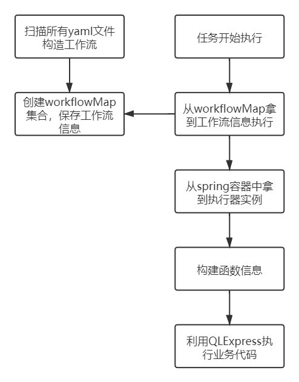

本工程只是一个demo工程，工程背景是在工作中的一个项目非常凌乱，结构复杂，抽象类、接口过多，可以简化，利用该demo去验证简化后的流程是否可以正确运行。

大致想法：

1、利用yml文件去定义工作流的流程

```yaml
workflowName: cpsmonthly

app: cps
type: monthly

steps:
  - name: DumpData
    handler: com.xiaohshi.qlexpress.task.CpsMonthlyTask::dumpData
    bind: DumpDataRunner

  - name: FirstCompute
    handler: com.xiaohshi.qlexpress.task.CpsMonthlyTask::firstCompute
    bind: FirstComputeRunner
#    inputs:
#      - name: id
#        type: int
#      - name: name
#        type: java.lang.String
```

上面定义了一个名为cpsmonthly的工作流

workflowName：工作流的名称，不允许重复

app: 标记该工作流的app，例如cpi、cps等

type：工作流的类型，只有monthly和daily两种想法

steps：该工作流的流程

name：step的名称

handler：该step的处理器，类的全名::方法名

bind：该步骤需要绑定到相应的执行器中，以模拟模板方法，需要自己根据业务去实现，在该demo中只有DumpDataRunner和FirstComputeRunner两个执行器

inputs：handler中方法中的参数定义，顺序要与函数的参数，该参数考虑是否需要，因为有一些方法中java8以下没有，无法通过反射获得参数信息，现在是通过反射的方法获得的参数信息。

在项目启动的时候去加载所有的yml文件构建工作流的流程信息。

2、利用spring容器和QLExpress实现整个流程，Springutil实现ApplicationContextAware接口可以获得ApplicationContext对象，从而可以获得spring容器中的对象，QLExpress是由阿里巴巴实现的规则引擎，也可以替换成反射执行，利用method.invoke方法，但是我个人认为利用QLExpress相对简单不少。

执行流程：



该demo依然使用策略模式、模板模式和工厂模式，采用切面编程的思想，相比原方案，利用yml、spring和QLExpress简化其结构，并且本身的业务代码不需要实现任何接口，不用关心内部的结构，利用yml去定义工作流，更加直观和方便。

要求：

java8或者以上

依赖spring